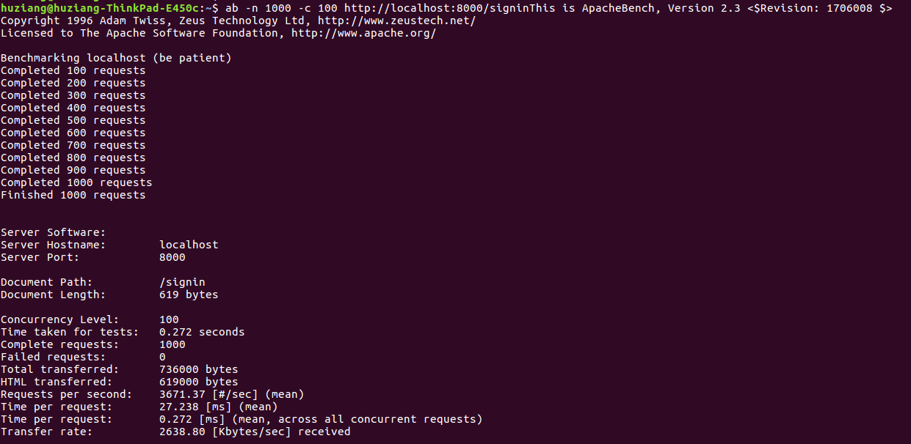
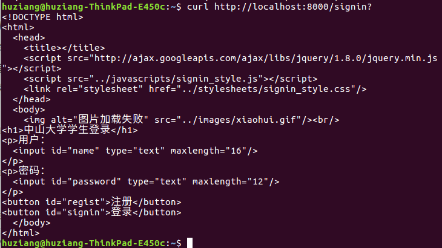
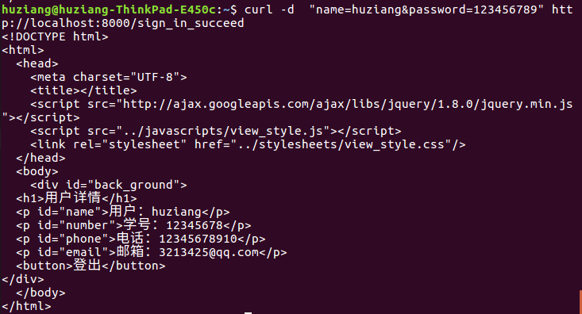
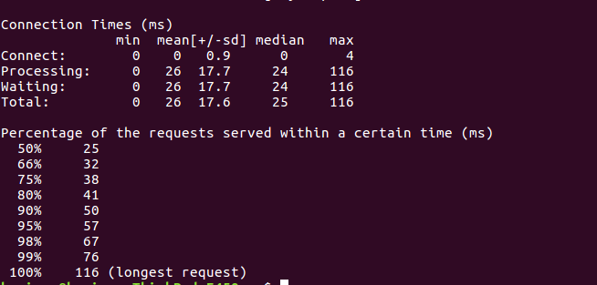

# CloudGo程序说明

> 注意事项：
>
> ​	必须部署在$GOPATH/src/github.com/bilibiliChangKai/Golang/HM3路径下，go get github即可

---

## 程序结构说明：

 
 

1. 使用了MVC框架，用反射绑定V和C，public文件夹保存V，server.go保存M，controller文件夹保存C。
2. 使用了martini包。
3. 由于SQL安装出了问题，因此没有服务端存储功能。

---

## crul测试：

GET /signin 所返回的登录页面。

POST /sign_in_succeed +账号密码 所返回的登录成功页面。

---

## ab测试：

####  **重要参数解释：**

1. 命令行参数:
   -n： 总共发出的请求数,此处为1000
   -c： 并发的线程数,此处为100

2. 重要结果参数:

   |         参数名          |                    含义                    |
   | :------------------: | :--------------------------------------: |
   |  Concurrency Level   |              压力测试并发的线程数,即-c              |
   | Time taken for tests |         本次压力测试所花费的总秒数,此处为0.272s          |
   |  Complete requests   |          成功收到的请求数,此处为1000,全部成功           |
   |  Total transferred   |           本次测试的总传输数据量,包括Header           |
   |   HTML transferred   |          本次测试的总传输数据量,只包括回传的html          |
   | Requests per second  |        平均每秒钟可以处理的请求数,此处为3671个/sec        |
   |   Time per request   | 上面一项是指每个线程执行一个请求平均所花的时间 下面一项是所有线程执行一个请求平均所花的时间 |
   |    Transfer rate     |          从ab到web serverr之间的传输速率          |

3. 最后一部分是压力测试的连线处理时间:

   |    参数名     |                                          |
   | :--------: | :--------------------------------------: |
   |    min     |                   最小值                    |
   |    mean    |                   平均值                    |
   |  [+/-sd]   |                  正负标准差                   |
   |   median   |                   中位值                    |
   |    max     |                   最大值                    |
   |  Connect   |      从ab发出TCP请求到web server所花费的链接时间       |
   | Processing |      TCP建立到HTTP response全部收到所花费的时间       |
   |  Waiting   | TCP建立到HTTP response收到第一个字节所花费的时间 (Waiting包含在Processing中) |
   |   Total    |          Connect+Processing的时间           |

   ​

   （PS：最后序列意思是X%个请求完成时所花费的时间.比如:50%的请求完成时,花费25ms.）
